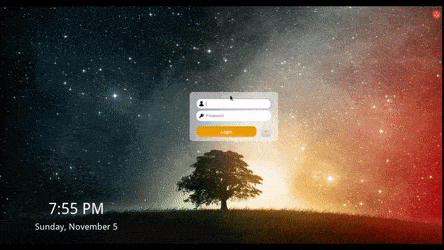
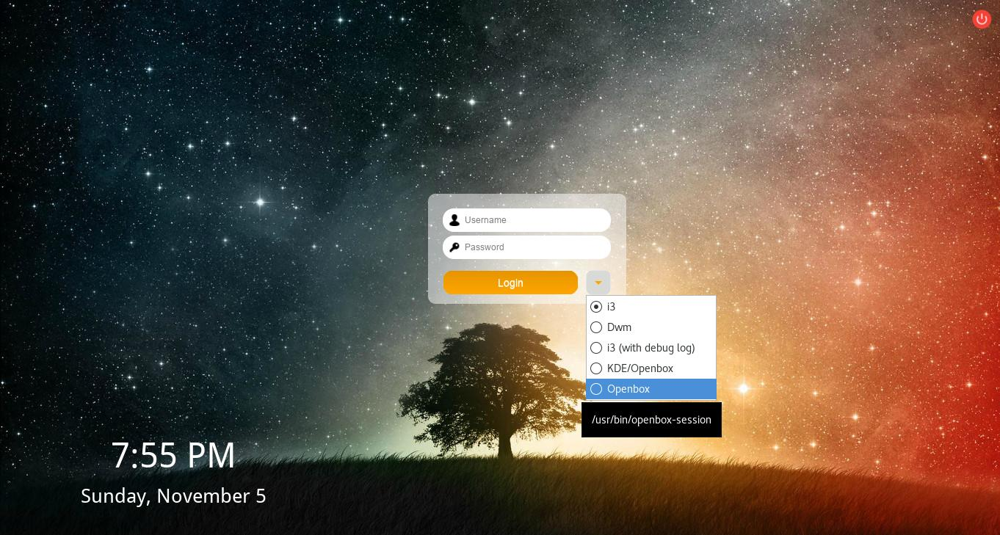

# EXTENSIBLE LOGIN MANAGER

## Introduction

The Extensible Login Manager (ELM) is a highly configurable login manager. Users
are able to create their own widgets that could be easily added to the login
manager.






## Requirements

The following packages are required:
- ttf-droid
- xcompmgr

## Installation

To install the _Extensible Login Manager_, run the following commands as root:

```
git clone https://github.com/gabeg805/Extensible-Login-Manager
mv Extensible-Login-Manager /etc/X11/elm
cd /etc/X11/elm
make
make install
```

## Uninstall

To uninstall the _Extensible Login Manager_, run the following command as root:

```
make uninstall
```

Note: The current directory containing all the Makefile, README, code, etc. will
be the only remnants of this package.

# Things to Implement

- [ ] Logout command line option.
- [ ] Setup and connect to the org.freedesktop.DisplayManager bus.
- [ ] Research policykit bus.
      ==== AUTHENTICATING FOR org.freedesktop.policykit.exec ====
      Authentication is needed to run `/usr/bin/mtunnel' as the super user
      polkit-agent-helper-1: error response to PolicyKit daemon: GDBus.Error:org.freedesktop.PolicyKit1.Error.Failed: No session for cookie
- [ ] Reduce reliance on static globals and pass in variables instead.
- [ ] To keep persistence of widgets, malloc and memcpy the memory.
- [x] Print to stdout/stderr, in addition to logging everything.
- [x] Add images to username/password entries.
